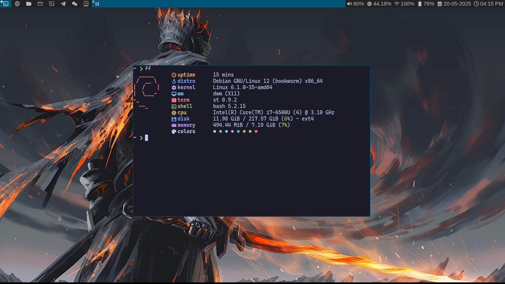

# My 2 linux setups
## Setup 1:
- OS: debian
- WM: dwm
- Status Bar: stock with slstatus
- Terminal: st

### Screenshot


---
## Setup 2:
- OS: Arch linux
- WM: Hyprland
- Status bar: Waybar
- Terminal: Alacritty

### Screenshot


### Dependencies
---
- #### Dwm
```bash
xserver-xorg libx11-dev libxft-dev libxinerama-dev build-essential \
pipewire pipewire-pulse wireplumber light pamixer pavucontrol lxappearance \
pcmanfm xarchiver mpv feh ristretto flameshot
```

- #### Hyprland
```bash
hyprland hyprpaper waybar xdg-desktop-portal-wlr xdg-desktop-portal-hyprland xdg-desktop-portal-gtk \
pipewire pipewire-pulse pipewire-alsa pipewire-jack wireplumber light pamixer bluez blueman pavucontrol \
nwg-look thunar thunar-archive-plugin thunar-volman gvfs firefox xarchiver eog vlc wofi wezterm \
eza zoxide fastfetch
```
---
## Neovim
```bash
neovim git nodejs npm unzip ripgrep wl-clipboard|xclip gcc
```
