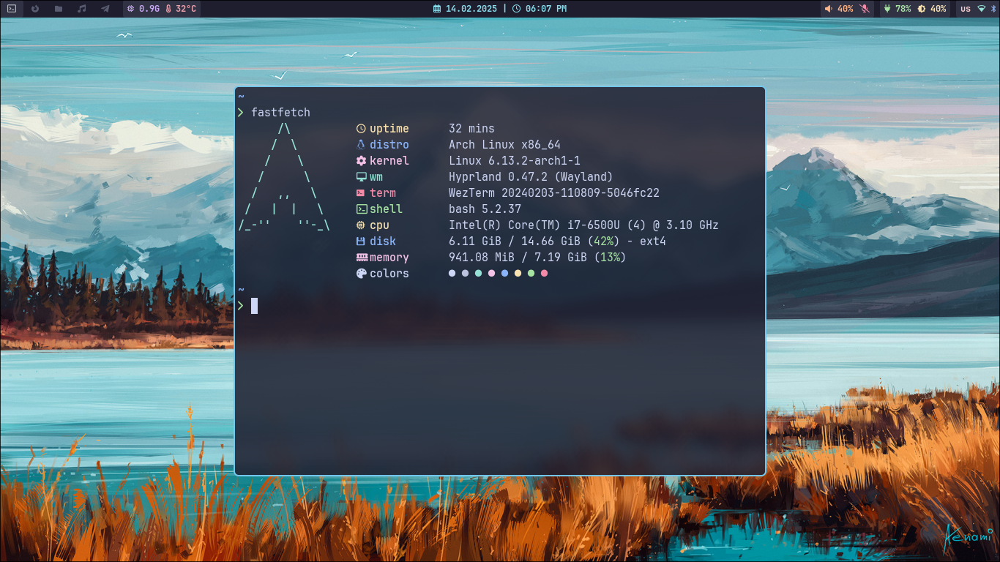

# My Setup
- OS: Arch linux
- WM: Hyprland
- Status bar: Waybar
- Terminal: Alacritty

#### Screenshot


### Dependencies
---

- #### Hyprland
```bash
hyprland hyprpaper waybar xdg-desktop-portal-wlr xdg-desktop-portal-hyprland xdg-desktop-portal-gtk \
pipewire pipewire-pulse pipewire-alsa pipewire-jack wireplumber brightnessctl bluez blueman pavucontrol \
nwg-look thunar thunar-archive-plugin thunar-volman gvfs firefox xarchiver ristretto vlc wofi wezterm \
eza zoxide fastfetch
```

- #### Neovim
```bash
neovim git nodejs npm unzip ripgrep wl-clipboard gcc
```
